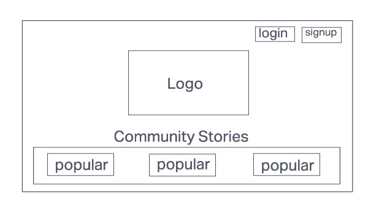
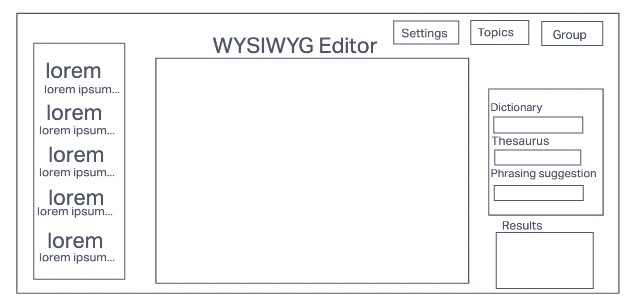
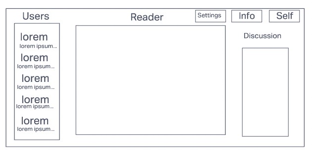

# React Redux Firebase Starter

## Getting Started

1. Install yarn. `npm install -g yarn`
2. `yarn install`
3. `yarn dev`

### Hosting

1. `npm install -g firebase-tools`
2. `firebase login`
3. `yarn deploy`

### Stuck?

Try This

1. Navigate to: <https://console.firebase.google.com/> (make sure you are using the same account as you used for login)
1. Open your project, and navigate to 'Project Overview > Project settings'
1. Scroll down to 'Your apps' section and click on the web-app symbol (</>)
1. Follow the prompts and in the 2nd step, copy down the `const firebaseConfig` section as you will need it soon
1. Navigate to 'Build > Authentication', click 'Get started', and then follow the prompts to setup 'email/password' and 'Google' providers
1. Navigate to 'Build > Firestore Database', click 'Create database', and select 'Start in test mode'
1. Navigate to 'Build > Storage', click 'Get started', and select 'Start in test mode'
1. In the root folder, **copy** `env.local.example` and rename to `env.local` and open it
1. Enter the `authDomain`, `apiKey`, `projectId`, `storageBucket` into `env.local` to their respective variables
1. `yarn dev`
1. Once you can run locally, run `yarn deploy`

<!---
*** WHEN YOU ARE UP AND RUNNING, DELETE EVERYTHING ABOVE ME EXCEPT THE VERY TOP LINE. ***
*** RENAME THE TOP LINE WITH YOUR PROJECT NAME. ***
-->

## Sprint Progress

Update your progress by checking off the tasks for each sprint. We will **not** be using issues for solo projects.

### Sprint 1

- [ ] Get app approved (DM Scott for approval)
- [X] Create mockups (physical paper, low-fi)
- [ ] Define scope (DM Scott for approval)
  - [X] Define milestones for each sprint
  - [ ] Define final deliverable for v1
- App must
  - [ ] Be publicly accessible
  - [ ] Have working authentication
  - [ ] Have technical component 5% done
 
- Initial milestones
  - [ ] Establish individual page w/ layout
  - [ ] Get DB connected / implement schema (user info {username, email, password}) (user data {title, content, tags})
  - [ ] Decide on auth method, review docs

### Sprint 2

- [ ] Technical component 25%
- [ ] Re-evaluate milestones and features

- [ ] Set WYSIWYG functionality with at least 3 themes / style choices
- [ ] Set user data to render, with functional navigation of data
- [ ] Auth 30% - handle bugs / errors

### Sprint 3

- [ ] Technical component 50%
- [ ] Re-evaluate milestones and features

- [ ] Establish API functionality with results field functioning
- [ ] Working DB for login / group page
- [ ] Working auth 100%

### Sprint 4

- [ ] Technical component 100%

- [ ] Finalize functionality (DB, routing, auth, forms, layout)
- [ ] Handle depolyment details
- [ ] test user stories (for individual with / without signup, with group an admin and member functionality)

## Mockups

|  |  |
| ------------------------ | ------------------------------------ |

| |
